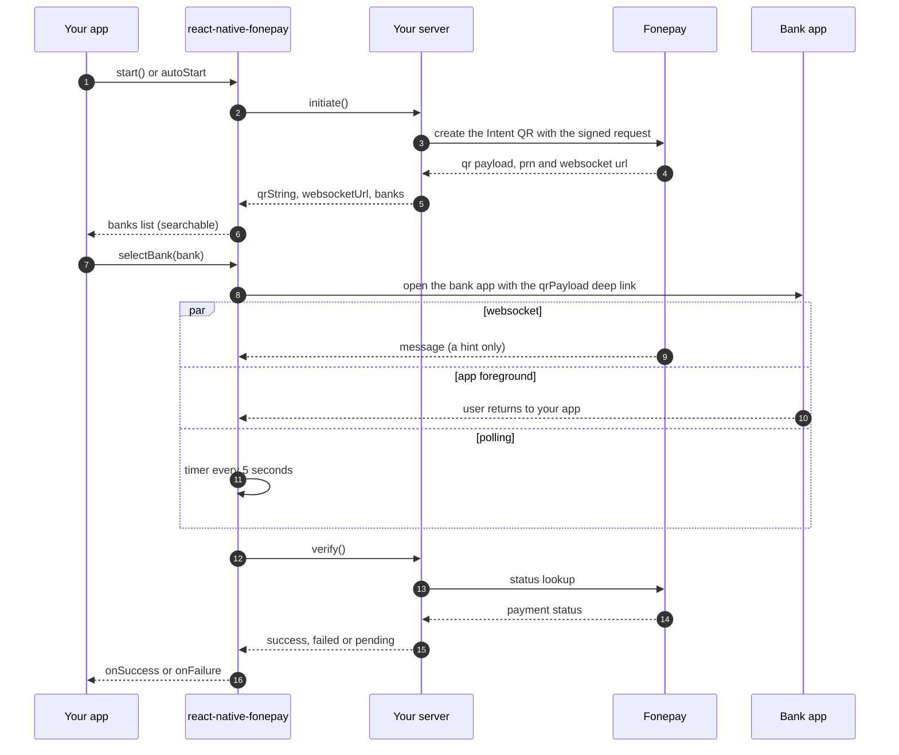
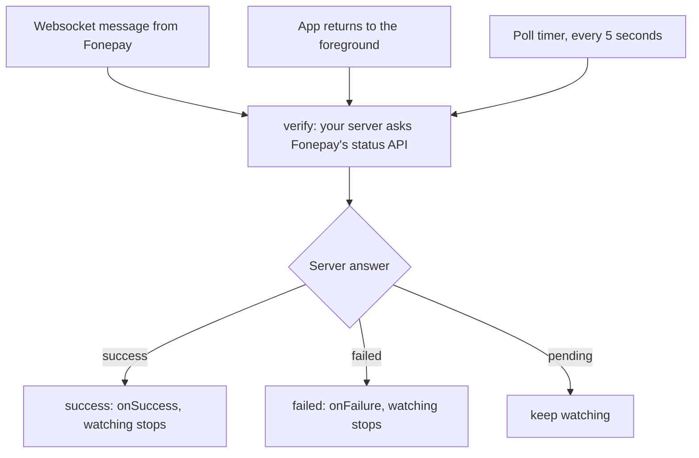
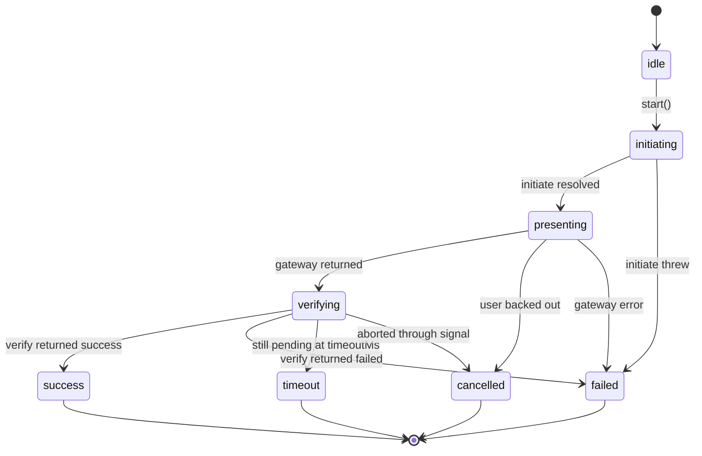

# @klixsoft/react-native-fonepay

[](https://www.npmjs.com/package/@klixsoft/react-native-fonepay)
[](https://www.npmjs.com/package/@klixsoft/react-native-fonepay)
[](https://github.com/klixsoft/react-native-fonepay/actions/workflows/ci.yml)
[](LICENSE)
[](#requirements)
[](#api)

Accept [Fonepay](https://fonepay.com) **Intent** payments in React Native: the user picks a bank or wallet, your app deep-links into that banking app, and the payment is confirmed through your server. Pure TypeScript with no native module to link, so it works in Expo too.

## Features

- Everything for a bank picker in one hook: `useFonepay({ initiate, verify })`
- Bank deep links (`<intentScheme>/?qrPayload=...`) and bank search
- Live confirmation from three sources (websocket push, app foreground, polling) that all funnel into your one `verify`
- Framework-free watcher (`createFonepayWatcher`) for custom UIs
- Pure TypeScript, typed, tested with Node's built-in test runner

## Table of contents

- [Requirements](#requirements)
- [Installation](#installation)
- [How it works](#how-it-works)
- [Quick start](#quick-start)
- [Usage](#usage)
- [Server contract](#server-contract)
- [API](#api)
- [Common mistakes](#common-mistakes)
- [Errors](#errors)
- [Security](#security)
- [Documentation](#documentation)
- [Versioning and releases](#versioning-and-releases)
- [Contributing](#contributing)
- [License](#license)

## Requirements

- React Native **0.70+** (any architecture) or Expo
- Android and iOS. No native code, no linking step.

## Installation

```sh
pnpm add @klixsoft/react-native-fonepay
# or: npm install @klixsoft/react-native-fonepay   /   yarn add @klixsoft/react-native-fonepay
```

Nothing else to configure. Opening a bank app needs no permissions. Only if you want to check whether a bank app is installed with `Linking.canOpenURL` do you need each bank's scheme in `LSApplicationQueriesSchemes` (iOS) and `<queries>` (Android 11+); `selectBank` does not need it and reports `E_OPEN_FAILED` when the app cannot open.

## How it works

Every Klixsoft payment package follows the same three-step lifecycle, so switching gateways does not change how your code is shaped:



> Diagrams are [Mermaid](https://mermaid.js.org). GitHub renders them; on npmjs.com they show as code, so read this README on GitHub for the pictures.

| Step | You provide | The package does |
| --- | --- | --- |
| **initiate** | A function that calls **your server**, which creates the payment with Fonepay and returns the QR session `{ qrString, websocketUrl?, banks }`. | Calls it once, at the start. |
| **present** | Nothing. | Deep-links into the bank or wallet the user picks (`selectBank`), then watches the payment through the websocket, app foreground and polling. No WebView, no native code. |
| **verify** | A function that calls **your server**, which asks Fonepay's status API and returns `success`, `failed` or `pending`. | Polls it until the payment settles, times out or is cancelled. |

The result of `present` is never treated as proof of payment. Only `verify` decides the outcome, and it should always be answered by your server from Fonepay's own API.

### Do I need `verify`?

Yes. Fonepay gives the device no proof of payment: returning from Fonepay only means the user came back. Only **your server**, asking Fonepay's API, knows whether it was paid, so `verify` is what turns "the user returned" into `success`. It is also what makes the flow resilient: if the app is killed or the network drops, calling `verify` again later gives the right answer.

### What happens after the user picks a bank

Three things can tell the app the payment finished. They all lead to the same single check with your server, so a missed message never leaves the user waiting:



A websocket message is only a hint to check sooner. It is never trusted as proof.

### Outcomes and states

While a payment runs, `status` moves through these states, and it always ends in exactly one outcome:



| Outcome | Meaning | Callback | What to show the user |
| --- | --- | --- | --- |
| `success` | Your server confirmed the payment. | `onSuccess` | The receipt or unlocked content. |
| `failed` | The payment failed, `initiate` threw, or the gateway reported an error. `error.code` says which. | `onError` | An error and a "Try again" button. |
| `cancelled` | The user backed out, or you aborted through `signal`. | `onCancel` | Nothing, or a neutral "Payment cancelled". |
| `timeout` | Still `pending` when `timeoutMs` ran out. **The payment may still complete**, so do not tell the user they were not charged. | `onError` (`E_TIMEOUT`) | "We are still confirming your payment", and check the order status later. |

`success` is only ever produced by your server (`verify`), except for Khalti without a `verify` (see below).

## Quick start

```tsx
import { useFonepay } from '@klixsoft/react-native-fonepay';

function FonepayPicker({ orderId, onPaid }: { orderId: string; onPaid: () => void }) {
  const { status, banks, search, setSearch, selectBank, check, checking, message } = useFonepay({
    initiate: () => api.post(`/orders/${orderId}/fonepay`),
    verify: async () => (await api.get(`/orders/${orderId}/status`)).status,
    onSuccess: onPaid,
    onError: (error) => Toast.show(error instanceof Error ? error.message : 'Could not start the payment'),
    autoStart: true,
  });

  if (status === 'initiating') return <ActivityIndicator />;

  return (
    <View>
      <TextInput value={search} onChangeText={setSearch} placeholder="Search bank or wallet" />
      {message ? <Text>{message}</Text> : null}
      {banks.map((bank) => (
        <Pressable key={bank.bankCode} onPress={() => selectBank(bank)}>
          <Text>{bank.bankName}</Text>
        </Pressable>
      ))}
      <Button title={checking ? 'Checking...' : 'Check payment status'} onPress={check} />
    </View>
  );
}
```

## Usage

### Hook

`useFonepay(options)`:

| Option | Default | Notes |
| --- | --- | --- |
| `initiate` | required | Returns the `FonepaySession` your server created. |
| `verify` | required | Returns `'success' \| 'failed' \| 'pending'`. |
| `onSuccess` / `onFailure` | none | Called once when the server settles the payment. |
| `onError` | none | Called when `initiate` throws. |
| `autoStart` | `false` | Call `initiate` on mount instead of waiting for `start()`. |
| `pollIntervalMs` | `5000` | Poll period. |

It returns `{ status, session, banks, search, setSearch, start, selectBank, check, checking, message, error, reset }`. `status` is `idle`, `initiating`, `awaiting`, `success` or `failed`.

### Without React

```ts
import { createFonepayWatcher, openBank } from '@klixsoft/react-native-fonepay';

const session = await api.post(`/orders/${orderId}/fonepay`);
const watcher = createFonepayWatcher({
  websocketUrl: session.websocketUrl,
  verify: () => fetchStatus(orderId),
  onSuccess: () => navigation.replace('Receipt'),
});
watcher.start();
await openBank(chosenBank, session.qrString);
watcher.stop();
```

A websocket "success" message is only a trigger to call `verify`; it is never trusted on its own.

### Generic building blocks

The same helpers are exported by all three Klixsoft payment packages, so you can build your own flow on top of them:

| Export | What it is |
| --- | --- |
| `runPaymentFlow(options)` | Runs `initiate`, `present` and `verify` in order and resolves with `{ outcome, initiation }`. |
| `usePaymentFlow(options)` | The same as a React hook: `{ start, cancel, reset, status, isProcessing, error }`. |
| `pollPaymentState(check, options)` | Polls your server until the state is `success` or `failed`; rejects `E_TIMEOUT` / `E_ABORTED`. |
| `PaymentState` | `'success' \| 'failed' \| 'pending'`, what `verify` returns. |
| `PaymentOutcome` | `'success' \| 'failed' \| 'cancelled' \| 'timeout'`, how a flow ended. |
| `PaymentStatus` | `'idle' \| 'initiating' \| 'presenting' \| 'verifying'` or a `PaymentOutcome`, for driving your UI. |

## Server contract

Your server needs to expose these endpoints (the names are examples, use your own routes):

| Endpoint on your server | Called by | What it must do |
| --- | --- | --- |
| `POST /orders/:id/fonepay` | `initiate` | Log in to Fonepay, create the Intent QR (signed with your private key), fetch the bank list, and return `{ qrString, websocketUrl, banks }`. |
| `GET /orders/:id/status` | `verify` | Call Fonepay's status lookup with the order's `prn`. Return `success` only for a completed payment of the expected amount and reference. |


`initiate` must return the session your server built from Fonepay's Intent QR and bank list:

```json
{
  "qrString": "<qr payload from Fonepay>",
  "websocketUrl": "wss://...",
  "banks": [{ "bankCode": "NBL", "bankName": "Nabil Bank", "intentScheme": "nabilmobilebanking:/", "bankIcon": "https://..." }]
}
```

Only `qrString` and `banks` are required. `verify` must call Fonepay's status lookup and report `success` only for a completed payment of the expected amount and merchant reference. See [Backend integration](docs/backend-integration.md).

## API

| Export | Purpose |
| --- | --- |
| `useFonepay(options)` | The whole lifecycle as a React hook. |
| `createFonepayWatcher(options)` | Framework-free `{ start, stop, check }`. |
| `openBank(bank, qrString)` | Open a bank app on the payment. |
| `buildBankDeepLink(bank, qrString)` | Build the deep link without opening it. |
| `filterBanks(banks, query)` | Search bank names. |
| `parseSocketMessage(raw)` | Interpret a websocket message (`success`, `declined`, `unknown`). |
| `FonepayError`, `FonepayErrorCode` | Typed errors. |

Full signatures and options are in the [API reference](docs/api-reference.md).

## Common mistakes

- **Putting the Fonepay credentials or private key in the app.** Signing must happen on your server.
- **Trusting the websocket.** A "success" message only triggers `verify`.
- **Returning banks without `intentScheme`.** Without it the bank app cannot be opened (`E_INVALID_ARGUMENTS`).
- **Creating a new session on every render.** Call `initiate` once (`autoStart`, or `start()`); calling it again creates a new QR.
- **A `verify` that is not idempotent.** It is called every few seconds; fulfil the order once and return `success` on later calls.
- **Expecting the payment to happen inside your app.** It completes in the bank's own app, so the user leaves and comes back.

## Errors

`FonepayError.code` is `E_OPEN_FAILED` (the bank app could not be opened, usually not installed) or `E_INVALID_ARGUMENTS`. The generic helpers raise `PaymentFlowError` with `E_INITIATE_FAILED`, `E_PRESENT_FAILED`, `E_VERIFY_FAILED`, `E_PAYMENT_FAILED`, `E_TIMEOUT`, `E_ABORTED` or `E_NO_VERIFY`.

### Typed results and errors

Everything is typed end to end. A flow result is a discriminated union on `outcome`, so TypeScript only lets you read what exists:

```ts
const result = await runPaymentFlow({ initiate, present, verify });

switch (result.outcome) {
  case 'success':
    result.initiation;
    break;
  case 'failed':
  case 'timeout':
    result.error.code;
    break;
  case 'cancelled':
    break;
}
```

There is one error model. Every failure is a `PaymentFlowError` with:

| Field | Type | Meaning |
| --- | --- | --- |
| `code` | `PaymentFlowErrorCodeValue` | Stable code: `E_INITIATE_FAILED`, `E_PRESENT_FAILED`, `E_VERIFY_FAILED`, `E_PAYMENT_FAILED`, `E_TIMEOUT`, `E_ABORTED`, `E_NO_VERIFY`. |
| `step` | `'initiate' \| 'present' \| 'verify' \| null` | Where in the flow it happened. |
| `cause` | `unknown` | The original error, for example your API's error or a `FonepayError`. |
| `isCancelled` | `boolean` | True for `E_ABORTED`. |

To handle Fonepay-specific errors, read the cause with the typed helper:

```ts
import { getFonepayError, PaymentFlowErrorCode } from '@klixsoft/react-native-fonepay';

onError: (error) => {
  const fonepayError = getFonepayError(error);
  if (fonepayError?.isCancelled) return;
  if (error.code === PaymentFlowErrorCode.InitiateFailed) showToast('Could not start the payment');
}
```

`isFonepayError(value)` and `isPaymentFlowError(value)` are type guards for values of unknown type.

## Security

- Fonepay credentials and the **RSA private key stay on your server**; the app only shows banks and opens a link.
- Websocket messages are hints. Only your server's call to Fonepay's status API proves payment.
- Make fulfilment idempotent and authenticate the status endpoint.

More in [docs/security.md](docs/security.md).

## Documentation

- [Backend integration](docs/backend-integration.md)
- [API reference](docs/api-reference.md)
- [Security](docs/security.md)
- [Troubleshooting](docs/troubleshooting.md)
- [Changelog](CHANGELOG.md)

## Versioning and releases

This package follows [Semantic Versioning](https://semver.org). While the version is `0.x`, minor releases may contain breaking changes; they are always listed in the [CHANGELOG](CHANGELOG.md). Releases are published to npm from a git tag by GitHub Actions with [provenance](https://docs.npmjs.com/generating-provenance-statements), see [CONTRIBUTING](CONTRIBUTING.md#releasing).

## Contributing

Issues and pull requests are welcome. Please read [CONTRIBUTING](CONTRIBUTING.md) first, and report security problems privately as described in [SECURITY](SECURITY.md).

## Disclaimer

This is an independent, community-maintained library. It is not affiliated with, endorsed by or supported by Fonepay.

## License

[MIT](LICENSE) © Klixsoft
